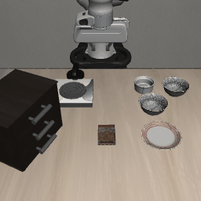

# OpenVLA Reproduction

Hands-on reproduction of [OpenVLA-7B](https://github.com/openvla/openvla): loading the model, running single-step action prediction, and driving a **closed-loop rollout** inside the [LIBERO](https://github.com/Lifelong-Robot-Learning/LIBERO) simulation environment.

> OpenVLA is a 7B Vision-Language-Action (VLA) model. Given a robot camera view and a natural-language instruction, it predicts the robot's next 7-DoF action.

## Result



Closed-loop rollout on a LIBERO `libero_spatial` task — 40 steps, with the model predicting actions in real time to drive the simulation.

## Contents

| File | Description |
| --- | --- |
| `openVLA-reproduce.ipynb` | Main notebook — the full reproduction pipeline, end to end |
| `first_frame.png` | First rendered frame from the LIBERO env, used to verify simulation + off-screen rendering |
| `rollout.gif` | Animated GIF of the model closed-loop controlling the simulation |

## Pipeline

The notebook is organized in four stages:

1. **Load the model** — load `openvla/openvla-7b` via `transformers` `AutoModelForVision2Seq`; `bfloat16` half precision uses ~14GB of VRAM.
2. **Single-step action prediction** — given a robot-scene image and the instruction `"pick up the object"`, call `model.predict_action(...)` to output a 7-DoF action vector `[Δx, Δy, Δz, Δroll, Δpitch, Δyaw, gripper]`.
3. **Set up LIBERO simulation** — clone and install LIBERO + robosuite, configure MuJoCo off-screen rendering, and render the first frame to confirm the environment works.
4. **Closed-loop rollout** — loop "render current frame → predict action → env.step()" inside the simulator, saving each frame into `rollout.gif`.

## Requirements

- **GPU**: ~14GB VRAM in `bfloat16` half precision (I ran it on a 48GB card with plenty of headroom).
- **Core dependencies** (OpenVLA is version-sensitive — pin these):

  ```bash
  pip install transformers==4.40.1 tokenizers==0.19.1 timm==0.9.10 accelerate
  ```

- **Simulation**: LIBERO, `robosuite==1.4.1`, `bddl==1.0.1`, plus MuJoCo's system-level rendering libraries
  (`libgl1-mesa-glx`, `libosmesa6`, `libglfw3`, `libglew-dev`, `patchelf`).

## Notes & Gotchas

Lessons learned while getting this to run:

- **The instruction must use OpenVLA's exact prompt format**, otherwise the model won't behave:
  ```
  In: What action should the robot take to {instruction}?
  Out:
  ```
- **Pick the right `unnorm_key`**: use `bridge_orig` for BridgeData action un-normalization. The wrong key produces actions at the wrong scale.
- **Headless rendering**: cloud servers have no display, so MuJoCo needs off-screen rendering. Try `MUJOCO_GL=egl` first; if it hangs, fall back to software rendering with `MUJOCO_GL=osmesa` (slower but reliable).
- **`pixel_values` dtype**: the model runs in `bfloat16`, but the processor emits `float32` tensors — cast them to `bfloat16` before feeding them in.

## References

- OpenVLA: https://github.com/openvla/openvla
- Model weights: https://huggingface.co/openvla/openvla-7b
- LIBERO: https://github.com/Lifelong-Robot-Learning/LIBERO

---

A personal learning project — not an official implementation.
