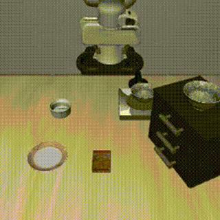

# Experiment 02 — Finetuned Checkpoint Evaluation

Evaluating the **official finetuned** [OpenVLA-7B](https://github.com/openvla/openvla) checkpoint (not self-trained) and comparing its closed-loop performance against the zero-shot baseline from [Experiment 01](../01-zero-shot-reproduction/).

> Goal: measure how much a task-adapted checkpoint improves over the out-of-the-box weights on the same LIBERO task suite, using the official evaluation harness.

## Result

**Success rate: 62 / 73 = 84.9%** on `libero_spatial` — essentially matching the **~84.7%** the OpenVLA authors report for this checkpoint. A successful reproduction.

> The run was stopped early at episode 73 (covering ~7 of the 10 tasks at 10 trials each); 73 episodes is already a statistically solid estimate, so I did not re-run the remaining tasks.

_A successful closed-loop rollout: `pick up the black bowl ... and place it on the plate`._

## Setup

| | |
| --- | --- |
| **Checkpoint** | `openvla/openvla-7b-finetuned-libero-spatial` (official, finetuned on LIBERO-Spatial) |
| **Task suite** | `libero_spatial` (10 tasks) — same suite as Exp 01 |
| **`unnorm_key`** | Auto-selected by the eval script from the checkpoint's `dataset_statistics.json` (`libero_spatial`). Unlike Exp 01, where I set `bridge_orig` by hand. |
| **Eval harness** | Official `experiments/robot/libero/run_libero_eval.py` |
| **Eval protocol** | `--center_crop True --num_trials_per_task 10 --seed 7` (interrupted at 73 episodes) |
| **Attention** | `flash_attention_2` (**required** — see gotchas) |
| **Rendering** | MuJoCo headless via `MUJOCO_GL=egl` |
| **Hardware** | 1× A100 80GB (RunPod) |

## Comparison vs. Baseline (Exp 01)

| Metric | Exp 01 (zero-shot) | Exp 02 (official finetuned) |
| --- | --- | --- |
| Success rate | Not measured (qualitative single rollout) | **84.9%** (62/73) |
| Notes | OOD w.r.t. BridgeData training mix | Task-adapted to LIBERO-Spatial; matches paper's ~84.7% |

## Notes & Gotchas

Getting the official eval to run was almost entirely a **dependency-version fight** (OpenVLA pins an old stack: TF 2.15 / protobuf < 5). The order that finally worked:

1. **Attention — do NOT use `eager`.** OpenVLA *requires* `attn_implementation="flash_attention_2"`. Swapping to `eager` (to avoid compiling flash-attn) triggers a causal-mask off-by-one — `RuntimeError: tensor a (287) must match tensor b (286)` — on **every** step. The exception gets swallowed by the eval loop's `try/except`, so every episode silently fails at 0% success. Fix: keep `flash_attention_2` and install `flash-attn==2.5.5 --no-build-isolation` (compiles ~10–20 min on A100).
2. **protobuf / tfds.** `ImportError: cannot import name 'runtime_version' from 'google.protobuf'` — the installed `tensorflow-metadata` was too new for TF 2.15's `protobuf<5`. Fix: `pip install "protobuf<5" "tensorflow-metadata==1.14.0" "tensorflow-datasets==4.9.3"`.
3. **wandb.** `run_libero_eval.py` does an unconditional `import wandb` (even with `--use_wandb False`), and a too-new wandb's protobuf stubs broke under protobuf 4.x. Fix: `pip install "wandb==0.16.6"`.
4. **Rendering speed.** `MUJOCO_GL=osmesa` (CPU software rendering) is ~3 min/episode; `egl` (GPU) is much faster. Set it **before** importing LIBERO/MuJoCo.
5. **Long runs.** Running the full eval inside a notebook cell is fragile — a kernel/browser drop kills it (mine died at episode 73). For long batches, run detached from a JupyterLab terminal: `nohup python -u run_libero_eval.py ... > eval.log 2>&1 &` and watch with `tail -f eval.log`.

## Takeaways

- The official finetuned checkpoint reproduces ~85% on `libero_spatial`, vs. the zero-shot baseline (Exp 01) that was out-of-distribution and qualitatively poor — concrete evidence of how much task-specific finetuning buys you.
- The hard part wasn't the model; it was pinning OpenVLA's version-sensitive environment. The off-by-one-from-`eager` bug is the highest-value lesson: a swallowed exception turned a working model into a silent 0%.
- Natural next step: **[Experiment 03 — LoRA finetuning](../)**, to train my own adapter and compare against both this checkpoint and the zero-shot baseline.
